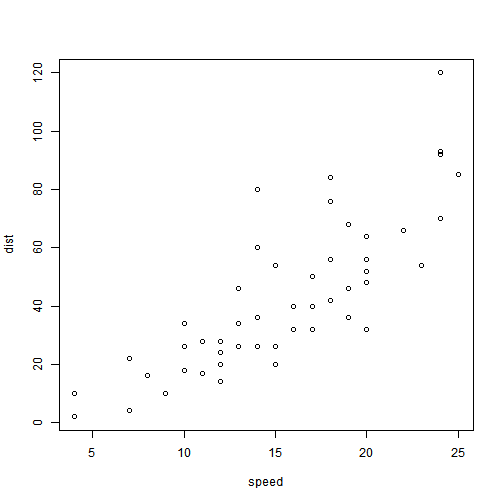

Chicken weight prediction application
========================================================

  

About 
========================================================
Application uses the ChickWeight data set to fit regression model.
Then you as user can use application to predict chicken weight.


ChickWeight Data Set
========================================================
Columns in dataset:

```
[1] "weight" "Time"   "Chick"  "Diet"  
```

Some exploration of data:
***
 

Regression model
========================================================


```r
fit <- lm(weight ~ Time + as.factor(Diet), data = ChickWeight)
```


```r
coef(fit)
```

```
     (Intercept)             Time as.factor(Diet)2 as.factor(Diet)3 
           10.92             8.75            16.17            36.50 
as.factor(Diet)4 
           30.23 
```


Use application to predict chicken weight
========================================================
After app webpage is loaded, you can select the Diet and use the Day slider bar on the left hand side to input parameters. 

Based on the fitted regression model, the app will predict chicken weight, given the diet and time.
